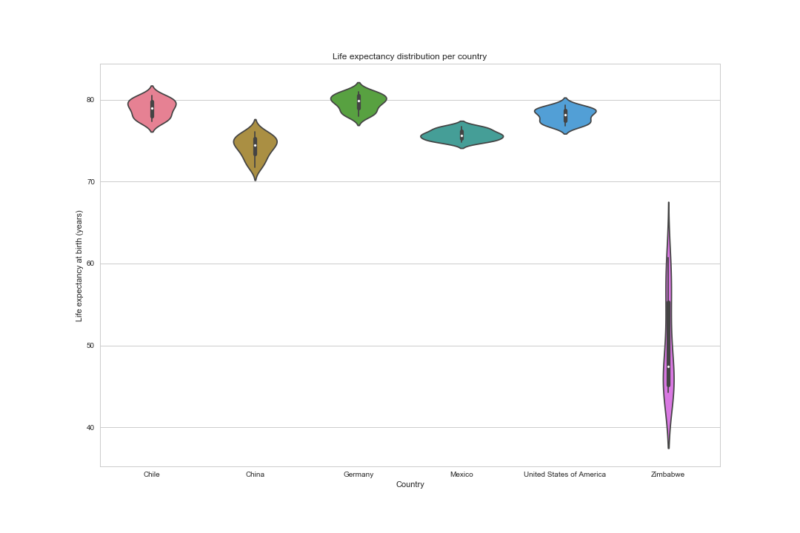

# How GDP influences Life Expectancy (or doesn't)

### Presenting data on GDP and life expectancy from the World Health Organization and the World Bank to try and identify the relationship between the GDP and life expectancy of six countries

By: Matt Gilbert — Tuesday, July 24th 2018

## Introduction

The purpose of this project is to investigate if there is a strong correlation between the economic output of a country and the life expectancy of its citizens. I am using data collected from 2000 through 2015 for six countries that represent the range of the socioeconomic characteristics found in countries around the world. The data has been compared from several different perspectives to show various ways that GDP and Life Expectancy relate to each other, or to the contrary, if they have no strong correlation at all.

The six subject countries are:
- Chile
- China
- Germany
- Mexico
- The United States
- and, Zimbabwe

GDP stands for Gross Domestic Product. GDP is a monetary measure of the market value of all final goods and services produced in a time period. The GDP values are in in Trillions of current US dollars.

All visualizations were created using the `Matplotlib`, `Pandas`, and `Seaborn` libraries for Python.

**Core Questions:**
- Has life expectancy increased over time in the six nations?
- Has GDP increased over time in the six nations?
- Is there a correlation between GDP and life expectancy of a country?
- What is the average life expectancy in these nations?
- What is the distribution of that life expectancy?

## The data

I now present the data showing any relationship between GDP and Life Expectancy. To show any relationships, I have generated four separate plots that show the data from various interesting perspectives.

### Average life expectancy

This graph shows the average life expectancy for our six country sample, averaged over the fifteen year period.

We can see that most countries in our sample enjoy a high life expectancy average with little variation in the range. Zimbabwe however is about 30 years lower than the other countries and has a wider range in those yearly values.

### Life expectancy distribution

Here is a `violinplot` showing the distribution of life expectancy ages per country. The shape of the distributions is a histogram showing the number of occurrences of each age in the range.

What we can see right away with this plot is that Zimbabwe appears to have the largest distribution range in the life expectancy at birth year. The median age is still quite low, but the upper range is begining to aproach the other countries. We can also identify that the other five countries in this sample all enjoy a rather stable life expectancy range with the majority of years aligning with, or exceeding, the median age for the 15-year period.

### GDP as a function of Life Expectancy

The goal of this `FacetGrid` is to make it easier to see the possible correlation between GDP and life expectancy. The `scatterplot` graphs per year help to show how the GDP as a function of Life Expectancy relate to each member country. They also illustrate movement of this relationship on a per-year basis when viewed sequentially.

There are a few items of note when you look at these graphs:
- Chile, Germany, and Mexico all have a GDP to Life Expectancy relation that doesn't change much over the 15-year timeframe
- China's GDP has increased each year (moving along the x-axis) yet it's life expectancy hasn't changed as much
  - The US has also seen an increase in GDP, though not as fast as China's
- Zimbabwe's Life Expectancy has increased each year (moving along the y-axis) yet it's GDP reamins largely unchanged

In the scatter plot grid above, it can be hard to isolate the change for GDP and Life expectancy over time. This data is better illustrated with a line graph for each GDP and Life Expectancy by country.

### Life Expectancy comparisson

In this `FacetGrid` we can more clearly see the relation of life expectancy over time for each country.

We can see that all sample countries except Zimbabwe have enjoyed a stable, generally high life expectancy at birth, and that life expectancy age is slowly increasing. Zimbabwe however, actually saw a decrease in the life expectancy age for the first five years of the data sample timeframe. Then around 2005, the life expectancy age started to rapidly increase. We will address possible reasons for this drastic change in life expectancy for Zimbabwe later in this post.

### GDP comparisson

Now we can visualize the relationship of GDP over time for each country.

In this `FacetGrid` it is apparent that China and the US have seen much larger growth in GDP than the other sample countries. We can also see that China's GDP growth is ocurring faster than in the US. We can also see a dip in the GDP growth for the US occurring in late 2007 - early 2008 when this country was experiencing it's "Great Recession".

### Observations from the comparissons

When we look at the Life Expectancy comparisson and the GDP comparisson together, we can make some interresting observations.

- China has seen the greatest increase in GDP over the 15-year timeframe
  - The reason for that is that China has greatly expanded it manufacturing capabilities, and has become the single largest exporter to the US.
- Zimbabwe has seen the greates increase in Life Expectancy over the 15-year timeframe
  - To answer why that is, Zimbabwe has been ravaged by HIV/AIDS, but in the last 10 years, progress has been made to help prevent spread of the disease and treat those afflicted
- Zimbabwe has seen the least change in GDP over the 15-year timeframe
- Germany, Mexico, and Chile have seen similar moderate growth in GDP over the 15-year timeframe
  - Chile, China, Germany, Mexico, and the US have very similar life expactancy and growth trends over the 15-year timeframe
- We can posit that:
  - Zimbabwe has seen a large increase in life expectancy due to better health care, despite it's economy's limited growth. Larger, established nations already had good health systems prior to the start of this data
  - Chile has a culture that supports a high life expectancy, but doesn't promote the economy
  - The US has a culture that values both productivity and health
  - China has put an emphasis on economic growth over quality of life
  - The scatterplot shows the movement in GDP as a function of life expectancy for the countries in relation to each other. The lineplots show individual trends per country in a way that can be easilly compared
- Having more countries to analyze and a longer timeframe to look at would have made it easier to come to conclusions
- GDP and Life Expectancy **do not** seem to be strongly correlated

### Answering our core questions

- Has life expectancy increased over time in the six nations?
  - Yes, all countries in this dataset have seen an increase in life expectancy.
- Has GDP increased over time in the six nations?
  - No, Zimbabwe's and Chile's GDP has remained virtually flat.
- Is there a correlation between GDP and life expectancy of a country?
  - No, there doesn't appear to be any correlation between GDP and Life Expectancy.
- What is the average life expectancy in these nations?
  - This is shown in the first graph in the article.
- What is the distribution of that life expectancy?
  - This is shown in the second graph in the article.

## Aside

This post is designed to present the results of my final assignment as part of [Codecademy](https://www.codecademy.com)'s "Visualizing Data with Python" 6-week course.

GDP Source: [World Bank](https://data.worldbank.org/indicator/NY.GDP.MKTP.CD) national accounts data, and OECD National Accounts data files.

Life expectancy Data Source: [World Health Organization](http://apps.who.int/gho/data/node.main.688)
